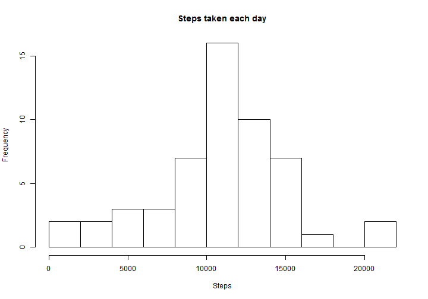
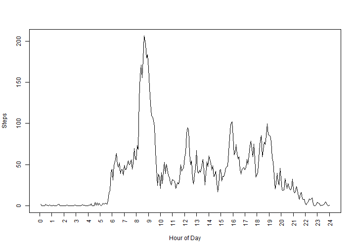
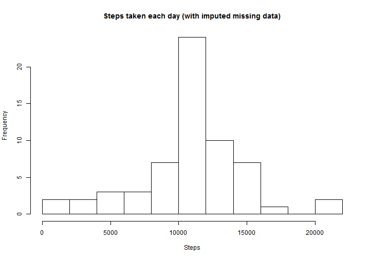
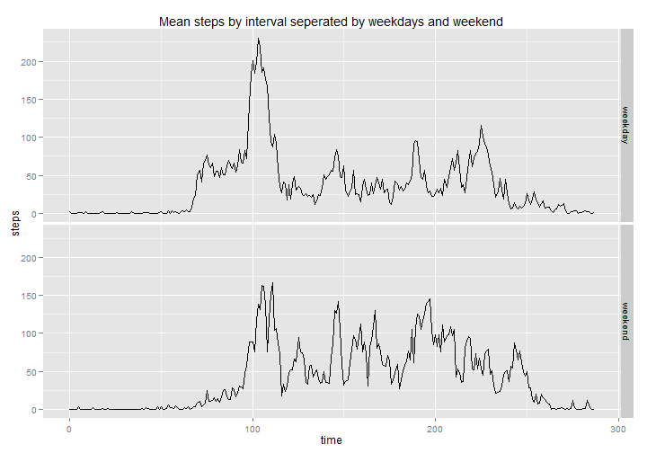
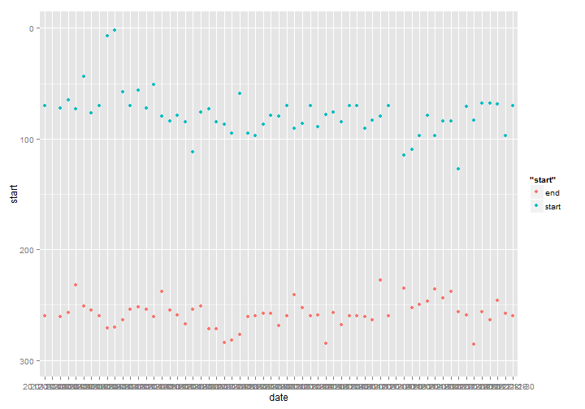
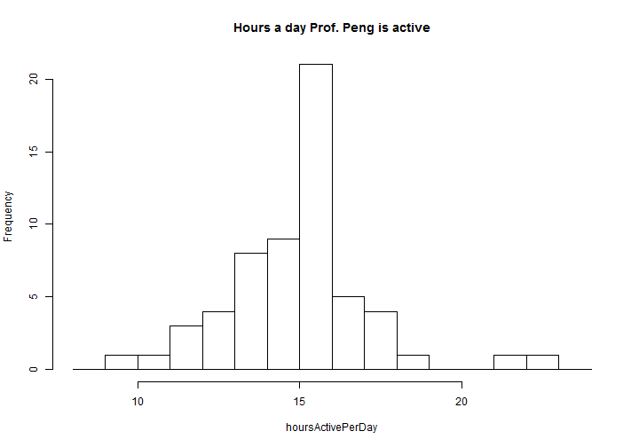

# Reproducible Research: Peer Assessment 1
This is my solution for the peer assessment 1 of the reproducable research course on coursera. You can find the assessment description [here](https://github.com/rdpeng/RepData_PeerAssessment1/blob/master/README.md). 

## Loading and preprocessing the data
Directly read the ziped data. (I learned how to read a zip directly from [stackoverflow](http://stackoverflow.com/a/3053883/55070).) We add a comand that switches of the scientific notation for not so big numbers.

```r
data <- read.csv(unz("activity.zip","activity.csv"))
options("scipen"=100, "digits"=4)
```
Check if we did read the data correctly and if they have the expected format.

```r
dim(data)
```

```
## [1] 17568     3
```

```r
head(data)
```

```
##   steps       date interval
## 1    NA 2012-10-01        0
## 2    NA 2012-10-01        5
## 3    NA 2012-10-01       10
## 4    NA 2012-10-01       15
## 5    NA 2012-10-01       20
## 6    NA 2012-10-01       25
```

```r
str(data)
```

```
## 'data.frame':	17568 obs. of  3 variables:
##  $ steps   : int  NA NA NA NA NA NA NA NA NA NA ...
##  $ date    : Factor w/ 61 levels "2012-10-01","2012-10-02",..: 1 1 1 1 1 1 1 1 1 1 ...
##  $ interval: int  0 5 10 15 20 25 30 35 40 45 ...
```

```r
summary(data)
```

```
##      steps               date          interval   
##  Min.   :  0.0   2012-10-01:  288   Min.   :   0  
##  1st Qu.:  0.0   2012-10-02:  288   1st Qu.: 589  
##  Median :  0.0   2012-10-03:  288   Median :1178  
##  Mean   : 37.4   2012-10-04:  288   Mean   :1178  
##  3rd Qu.: 12.0   2012-10-05:  288   3rd Qu.:1766  
##  Max.   :806.0   2012-10-06:  288   Max.   :2355  
##  NA's   :2304    (Other)   :15840
```
Transform the data a bit to have it more in the shape we want:

```r
data$date <- as.character(data$date)
data$interval <- as.factor(data$interval)
str(data)
```

```
## 'data.frame':	17568 obs. of  3 variables:
##  $ steps   : int  NA NA NA NA NA NA NA NA NA NA ...
##  $ date    : chr  "2012-10-01" "2012-10-01" "2012-10-01" "2012-10-01" ...
##  $ interval: Factor w/ 288 levels "0","5","10","15",..: 1 2 3 4 5 6 7 8 9 10 ...
```

## What is mean total number of steps taken per day?
Histogram of how many steps where taken by day.

```r
stepsByDay <- aggregate(steps ~ date, data, sum)
Steps <- stepsByDay$steps
hist(Steps, breaks=10, main="Steps taken each day")
```




```r
meanSteps <- mean(Steps)
medianSteps <- median(Steps)
```
The mean of total steps per day over all days is 10766.1887 and the median of it is 10765. 

## What is the average daily activity pattern?
We create a time series plot with the average number of steps taken, averaged across all days.

```r
meanDay <- aggregate(steps ~ interval, data, function(x) mean(x, na.rm=T))
plot(meanDay$steps, type="l", xlab="Hour of Day", ylab="Steps", xaxt="n")
axis(1,at=seq(0,288+12-1,12), labels=0:24, las=2)
```



As described in the excercise we are interested in which 5-minute interval the maximum number of steps are, on average across all the days, taken.

```r
maxinterval <- meanDay[which.max(meanDay$steps),"interval"]
time <- gsub('^([0-9]*)(.{2})$', '\\1:\\2', maxinterval)
```

In the averaged data, most steps are done at 8:35 in the morning.

## Imputing missing values
We calculate for each row if it contains any na data and then sum them up. So that we get the number of rows with missing data. For controling reason we also look how the NAs are distributed in the columns.

```r
rowHasNa <- sapply(is.na(data),any)
sum(rowHasNa)
```

```
## [1] 2304
```

```r
colSums(is.na(data))
```

```
##    steps     date interval 
##     2304        0        0
```

We can see that only the step row contains missing data.

We create a dublicate of the dataset called cleanedData and replace the NAs in this dataset with the previous calculated mean of the 5-minute interval. (To do so, we name the rows in the mean dataframe equal the interval, which makes a fast lookup possible.) We round the result, as only full steps do make sense.

```r
rownames(meanDay) <- meanDay$interval
cleanedData <- data
cleanedData[is.na(cleanedData$steps),"steps"] <- meanDay[as.character(data[is.na(cleanedData$steps),"interval"]),"steps"] 
cleanedData$steps <- round(cleanedData$steps)
```
We create again a histogram of the newly created data.

```r
stepsByDay <- aggregate(steps ~ date, cleanedData, sum)
Steps <- stepsByDay$steps
hist(Steps, breaks=10, main="Steps taken each day (with imputed missing data)")
```



```r
meanSteps <- mean(Steps)
medianSteps <- median(Steps)
```

The mean of total steps per day over all days is 10765.6393 and the median of it is 10762 in the cleaned dataset. It's clear that the numbers are realy close to the original dataset.

It commes with no surprise that the distribution looks very simular to the last histogram. However, the frequency is higher as we have now more datapoints.


## Are there differences in activity patterns between weekdays and weekends?
We introduce a new factor workday that describes if the day is a weekday or on a weekend. We first set the local to english for better reproducibility. (However this will only work on windows machines, see [locals](http://stat.ethz.ch/R-manual/R-patched/library/base/html/locales.html).)

```r
Sys.setlocale("LC_TIME", "English")
```

```
## [1] "English_United States.1252"
```

```r
cleanedData$workday <- factor(weekdays(as.Date(data$date)) %in% c("Sunday","Saturday"), levels=c("FALSE","TRUE"),labels=c("weekday","weekend"))
```
Now we plot the time series for the weekend and weekday data seperately.

```r
library(ggplot2)
cleanedData$intervalid <- rep_len(0:287,nrow(cleanedData))
qplot(intervalid,steps,data=cleanedData,stat="summary", fun.y = "mean", geom="line", facets=workday~., xlab="time", 
      main="Mean steps by interval seperated by weekdays and weekend")
```



In this plot you can clearly see that the activity in the morning (probably the walk into the office) is more clearly visible on weekdays and that the activity in the evening is longer on weekends.

## Appendix A - System Settings
The operating system on which this operation was performed is a Windows 7 Professional 64bit. On a machine with 8 GB of RAM and a the Processor is a  Intel(R) Core(TM) i7-4600U CPU @ 2.10GHz.  Info about the R System used and loaded libraries follow:

```r
sessionInfo()
```

```
## R version 3.1.0 (2014-04-10)
## Platform: x86_64-w64-mingw32/x64 (64-bit)
## 
## locale:
## [1] LC_COLLATE=German_Switzerland.1252  LC_CTYPE=German_Switzerland.1252   
## [3] LC_MONETARY=German_Switzerland.1252 LC_NUMERIC=C                       
## [5] LC_TIME=English_United States.1252 
## 
## attached base packages:
## [1] stats     graphics  grDevices utils     datasets  methods   base     
## 
## other attached packages:
## [1] ggplot2_0.9.3.1 knitr_1.6      
## 
## loaded via a namespace (and not attached):
##  [1] colorspace_1.2-4   dichromat_2.0-0    digest_0.6.4      
##  [4] evaluate_0.5.5     formatR_0.10       grid_3.1.0        
##  [7] gtable_0.1.2       labeling_0.2       markdown_0.7      
## [10] MASS_7.3-31        mime_0.1.1         munsell_0.4.2     
## [13] plyr_1.8.1         proto_0.3-10       RColorBrewer_1.0-5
## [16] Rcpp_0.11.1        reshape2_1.2.2     scales_0.2.3      
## [19] stringr_0.6.2      tools_3.1.0
```

## Appendix B - Additional Analysis
This analysis are not directly part of the assignement, but as they might be interesting I just publish them anyway.

### Mean and Median of steps per day
We calculate the mean and median number of steps taken per day

```r
stepsByDay <- aggregate(steps ~ date, data, function(x) c(mean=mean(x, na.rm=T), median=median(x, na.rm = T)))
head(stepsByDay)
```

```
##         date steps.mean steps.median
## 1 2012-10-02     0.4375       0.0000
## 2 2012-10-03    39.4167       0.0000
## 3 2012-10-04    42.0694       0.0000
## 4 2012-10-05    46.1597       0.0000
## 5 2012-10-06    53.5417       0.0000
## 6 2012-10-07    38.2465       0.0000
```
Now it looks surprising that the median are all zero above. Actually we allways get zero, as we find out next:

```r
any(stepsByDay$steps[,"median"] != 0)
```

```
## [1] FALSE
```
Is this result correct? Let us check:

```r
medianAnalyzes <- aggregate(steps ~ date, data, function(x) c(len=length(x),zeros=sum(x==0)))
head(medianAnalyzes)
```

```
##         date steps.len steps.zeros
## 1 2012-10-02       288         286
## 2 2012-10-03       288         207
## 3 2012-10-04       288         188
## 4 2012-10-05       288         202
## 5 2012-10-06       288         182
## 6 2012-10-07       288         180
```

```r
medianAnalyzes$steps[,"len"]/2 > medianAnalyzes$steps[,"zeros"]
```

```
##  [1] FALSE FALSE FALSE FALSE FALSE FALSE FALSE FALSE FALSE FALSE FALSE
## [12] FALSE FALSE FALSE FALSE FALSE FALSE FALSE FALSE FALSE FALSE FALSE
## [23] FALSE FALSE FALSE FALSE FALSE FALSE FALSE FALSE FALSE FALSE FALSE
## [34] FALSE FALSE FALSE FALSE FALSE FALSE FALSE FALSE FALSE FALSE FALSE
## [45] FALSE FALSE FALSE FALSE FALSE FALSE FALSE FALSE FALSE
```
We can see above that for each day there are more 0 values massured than one with steps, therefore it's clear that the median has to be zero.

For the cleaned dataset we can see bellow that the mean as well as the median changed slightly. 

```r
stepsByDay <- aggregate(steps ~ date, cleanedData, function(x) c(mean=mean(x, na.rm=T), median=median(x, na.rm = T)))
head(stepsByDay)
```

```
##         date steps.mean steps.median
## 1 2012-10-01    37.3681      34.5000
## 2 2012-10-02     0.4375       0.0000
## 3 2012-10-03    39.4167       0.0000
## 4 2012-10-04    42.0694       0.0000
## 5 2012-10-05    46.1597       0.0000
## 6 2012-10-06    53.5417       0.0000
```

### Activity period per day
I'm also interested how many hours a day Prof. Peng is active. For the analysis we first look at one random day.

```r
aDay <- data[data$date =="2012-10-12",]
print(aDay$steps)
```

```
##   [1]   0   0   0   0   0   0   0   0   0   0   0   0   0   0   0   0   0
##  [18]   0  38   0   0   0   0   0   0   0   0   0   0   0   0   0   0   0
##  [35]   7   0   0   0   0   0   0   0   0   0   0   0   0   0   0   0   0
##  [52]   0   0   0  48   0   0   0   0   0   0   0   0   0   0   0   0   0
##  [69]  30  92   0  11   0  10  19 111  38  16  29   9  45  35  53  43   8
##  [86]  40   0  32  57  35 117 117  25  95  29 141  51 123 440 687 614 474
## [103] 750 742 770 735 746 748 802 280  31   0   0   0   0   0   0   7  92
## [120]   0   0   0   0   0  46   7   0 328 156   0   0   0 129 339 150   0
## [137]   0   0  70   0   9   0   0   0  70   0   0   0   0   0   0   0  18
## [154]  91   0   0   0  75   0   0   0   0  99   0   0   0   0  96  16  20
## [171] 144 321 267   0   0   0   0   0   9   0   0  24  78   0  26  35   0
## [188]   0   0 365  90 432 275  34   0  92  15   0   0   0   0  20  10   9
## [205]   0   0  32  24   0   0  38  40  19  71   2  21   0 433 463 511 298
## [222] 500 473 506  24  35  41  46   0   0   0  16  23   0   0   0  18  54
## [239]  36   0   0   0   0   0   0   0   0   0   0  18  30  23  70 113   0
## [256]   0   0   0   0   0   0   0   0   0   0   0   0   9   0   0   8   0
## [273]   0   0   0   0   0   0   0   0   0   0   0   0   0   0   0   0
```
We see that also in the early hours, probably during light sleep hours, some steps are measured. Most likely this "steps" occour only due to movement in the sleep that's measured by mistake as step.

With a simple algorithm we want to predict real activity. We define a interval as active if it has more than 10 steps and the next interval is active as well. We are then interested in the first and last activite interval.

```r
active <- which(aDay$steps > 10 & c(0,head(aDay$steps,-1)) > 10)
startActivity <- head(active,1)
endActivity <- tail(active,1)
```
So for the date 2012-10-12 the first active interval is number 70 and the last active interval is the one with number 254.

We do this analysis now for all the days.

```r
activityPeriod <- aggregate(steps ~ date, cleanedData, function(x) {
  active <- which(x > 10 & c(0,head(x,-1)) > 10)
  startActivity <- active[0]
  if(length(active) == 0) {
    return(c(start=NA,end=NA))
  }else {
    return(c(start=head(active,1), end=tail(active,1)))
  }
})
activityPeriod<- data.frame(date=activityPeriod$date,start=activityPeriod$steps[,1], end=activityPeriod$steps[,2])
```

In the plot bellow we see the start and end of the activity by day.

```r
ggplot(activityPeriod, aes(date)) + ylim(300,0) +
  geom_point(aes(y = start, colour = "start")) + 
  geom_point(aes(y = end, colour = "end"))
```

```
## Warning: Removed 2 rows containing missing values (geom_point).
## Warning: Removed 2 rows containing missing values (geom_point).
```



Now for the final plot we show the histogram with the hours per day Prof. Peng is active.

```r
hoursActivePerDay <- (activityPeriod$end - activityPeriod$start) * 5 / 60
hist(hoursActivePerDay, breaks=8:24, main="Hours a day Prof. Peng is active")
```



Some numbers might be not quite right. For example when Prof. Peng is still active after midnight this get's allready added to the next day.


